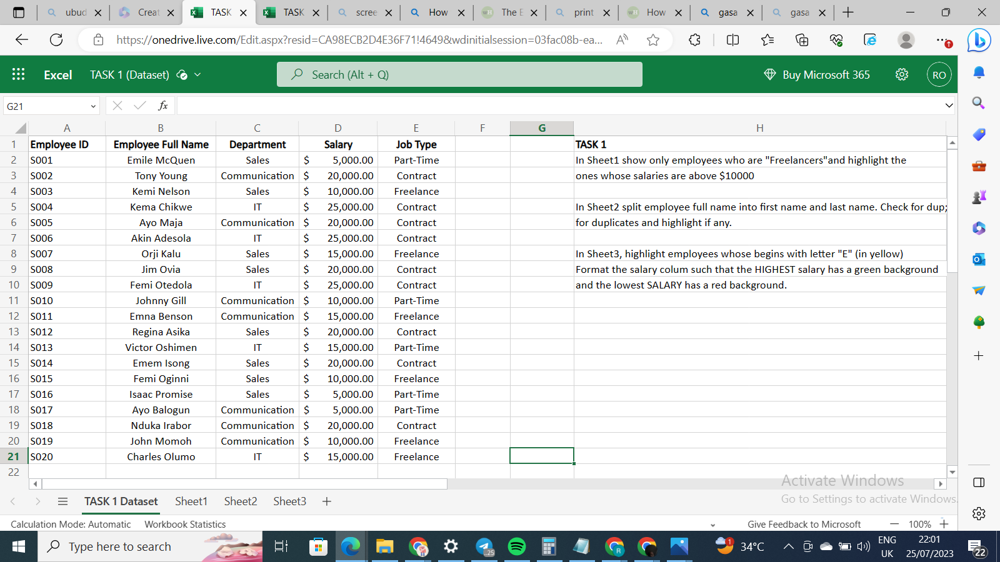
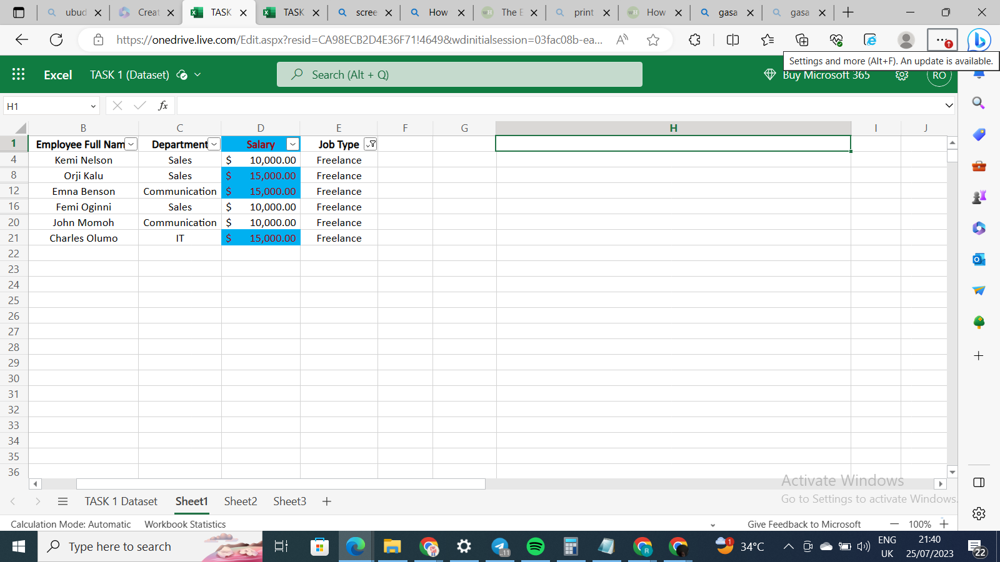
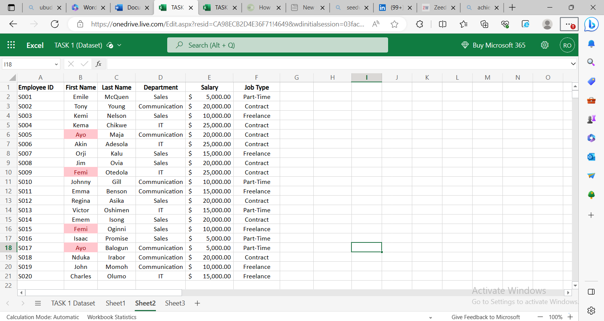
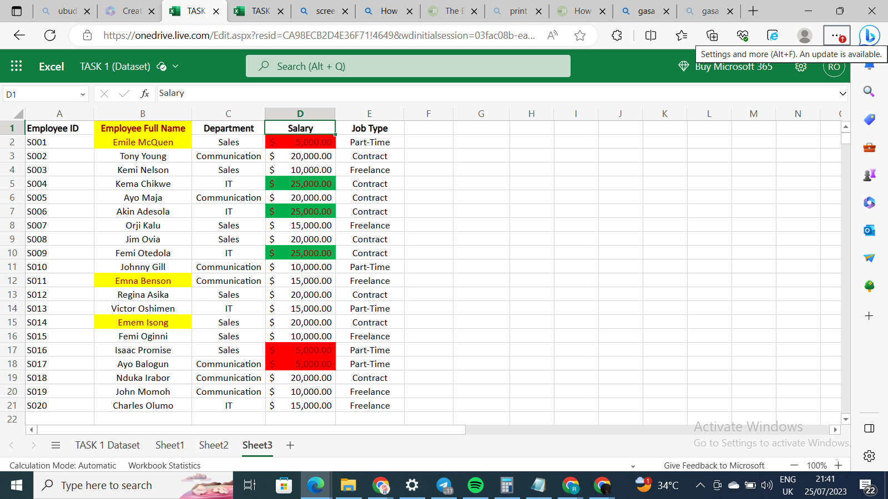

# Data-Analysis-Cohort-3

## Introduction
This is the first assigned task of the **3rd Data Analytics Cohort** for beginners facilitated by **Nonso Promise**, a data analytics coach. We are required to create an Excel dataset, consisting of 20 rows and 5 columns with 5 variables: **Employee ID, Employee Full Name, Department, Salary, and Job Type**. 

## TASK 1
- In Worksheet 1, we are to identify " freelancers " employees earning above $10,000. 
- In Worksheet 2, we are instructed to split the employee's full name into first name and last name and highlight, if there is, any form of duplicate values on the table. 
- In Worksheet 3, we are to identify and highlight employees whose names begin with the letter “**E**” in yellow and highlight the highest salary value in green and the lowest in red. 

## Skills Demonstrated 

1. Data Manipulation 
2. Use of Conditional Formatting 
3. Use of Filters 
4. Use of Text to Column
   
## Dataset 

## Data Manipulation 
Getting started, I filtered across each column header in the table using the **filter function**. Then, I filtered the data in the **Job Type** column to reveal only employees working as “freelancers”. Thereafter, I applied the **conditional formatting function**, by highlighting the **Salary column**, setting the rule to highlight cells **greater than** $10,000 in blue. 

 

 ## Text-to-column and Conditional Formatting 
 In Worksheet 2 as required, split the full name of employees in first and last names. To pull this off, I inserted an extra column to the right-hand side of the **Employee Full Name** column, then, from the data tab, I applied the **text-to-column** function, indicating ‘space’ as the delimiter between the data. Again, I used **conditional formatting** to highlight duplicate data within the newly created **First and Last name** columns and signify duplicates with color pink. 
 
 

## Conditional Formatting
 In Worksheet 3, using the raw dataset, I highlighted the **Employee Full Name** column then used **conditional formatting** to highlight with yellow fill, to signify employees whose names started with the letter “E”. And lastly, for **TASK 1**, I applied **conditional formatting** on the **Salary** column, and engaged the rule to highlight cells with the highest value in green, and the lowest in red color respectively. 
 
 

 

## Conclusion 
It's exciting doing this. Hang in here for more.

Thank you for your attention.  

 
 

  
